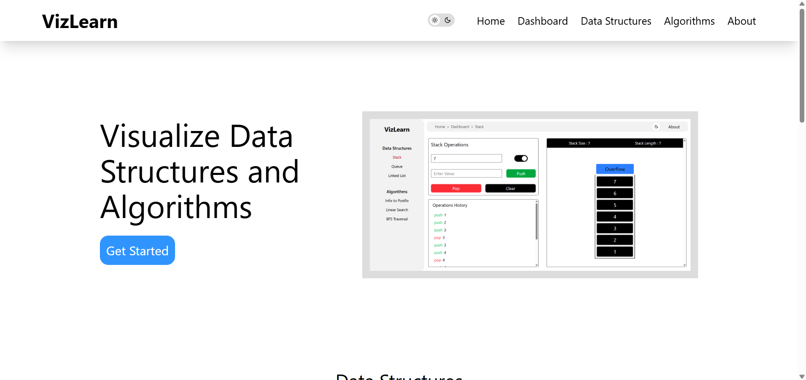

# VizLearn - The DSA Visualizer

## 🚀 About

VizLearn is an interactive Data Structures and Algorithms (DSA) visualizer designed to help students and developers understand complex concepts through animated visualizations. It provides step-by-step explanations for various algorithms and data structures, making learning more engaging and effective.

## 🌟 Features

📌 **Visualizations for Stack, Queue, and Linked List**.

🛠 **Algorithm animations for Infix to Postfix conversion and Linear Search**.

🏆 **User input support** for customized visualizations.

🎨 **Interactive UI** for a seamless learning experience.

🌗 **Light & Dark Mode support** for better accessibility and user preference.

## 📸 Screenshots

### Home Page & Dashboard
<p align="center">
  
  
</p>

### Stack, Queue & Linked lists Visualization
<p align="center">
  
  
  
</p>

### Infix to Postfix & Linear Search Visualization  
<p align="center">
  
  
</p>

## 🔧 Installation

To set up VizLearn locally, follow these steps:
```bash
# Clone the repository
git clone https://github.com/your-username/viz-learn.git

# Navigate to the project folder
cd viz-learn

# Install dependencies
npm install

# Run the development server
npm start
```
Open http://localhost:3000/ in your browser to access the application.

## 🎯 Usage

Select a Data Structure (Stack, Queue, Linked List) or Algorithm (Infix to Postfix, Linear Search) from the menu.

Click on the Start Visualization button.

Observe the step-by-step execution of the algorithm.

Experiment with different inputs to see how the algorithm adapts.

## 🚀 Future Enhancements

We have exciting plans to expand VizLearn further! Here’s what’s coming next:

🔜 Graph Algorithms - BFS and DFS Traversal Visualizations.

🔜 Sorting Algorithms - Step-by-step animations for Sorting techniques.

🔜 More Data Structures - Including Trees and Heaps.

🔜 Enhanced User Interactions - More control over animations and inputs.

🔜 Algorithm Race Mode - Compare different algorithms side by side to analyze their efficiency.

## 🤝 Contributing

We welcome contributions to improve VizLearn! To contribute:
```bash
# Fork the repository on GitHub
git fork https://github.com/your-username/viz-learn.git

# Clone your forked repository
git clone https://github.com/your-username/viz-learn.git

# Navigate to the project folder
cd viz-learn

# Create a feature branch
git checkout -b feature-branch

# Make your changes and commit
git commit -m "Add new feature"

# Push to your branch
git push origin feature-branch
```
Then, create a Pull Request on GitHub.

## Live Website

Check out the live version of this project: [https://viz-learn.vercel.app]

## GitHub Repository

You can find the repository for this project on GitHub: [https://github.com/Siddharth9304/viz-learn]

## 📞 Contact

Project Maintainer: Prem Siddhartha

Email: premsiddcoding@gmail.com

GitHub: [https://github.com/Siddharth9304]

🎓 Empower your DSA learning with VizLearn! 🚀


